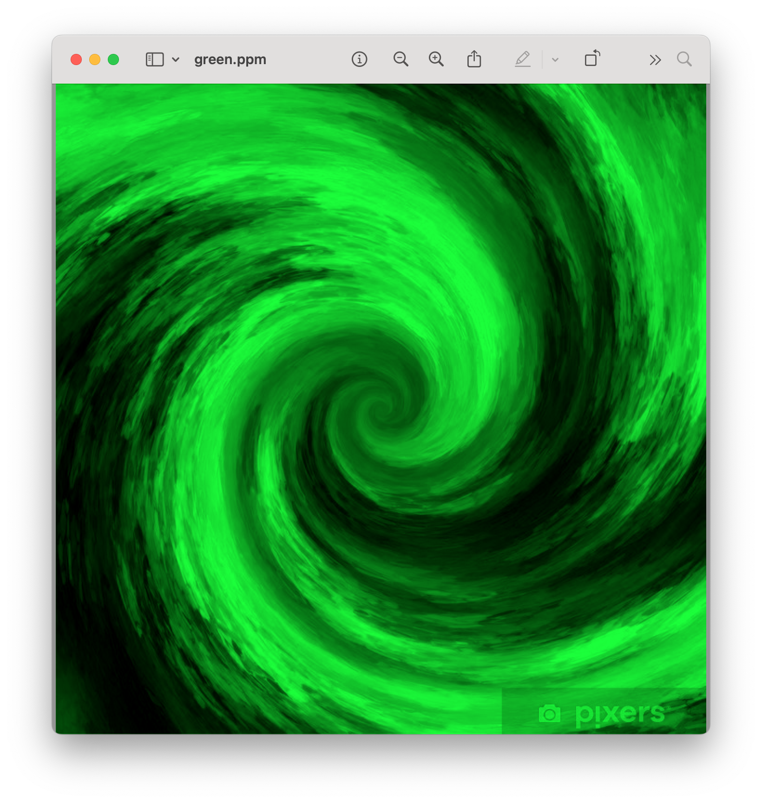
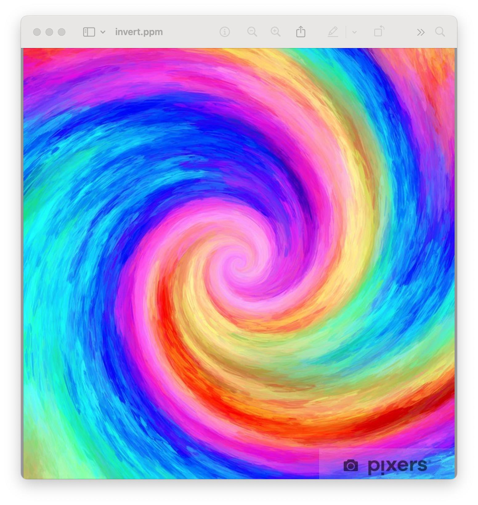

2# ppm-image-processing
Java image-processing program that reads and writes PPM files and applies colors filters through RGB pixel manipulation.

## Features 
- Red filter
- Green filter
- Blue filter
- Grayscale filter
- Invert filter
- Reads PPM image files
- Writes processed PPM output files

## Technologies Used
-Java
File I/O
Arrays
RGB pixel manipulation

## Project files
-`Main.java` - handles user input and filter selection
-`PPMFilter.java` - processes image data and applies filters
-`green.ppm` - example filtered output
-`invert.ppm` - example filtered output

## What I Learned
This project helped me practice working with binary image data, reading, and writing files, manipulating RGB values, using arrays, and organizing a Java program across multiple classes.

## Results

### Original Image

### Green Filter

### Invert Filter

